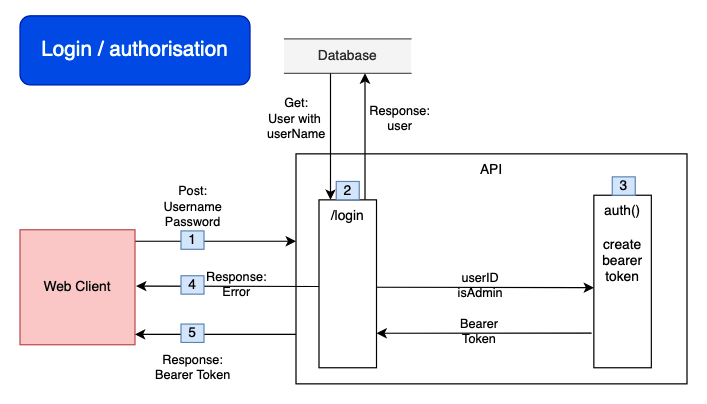
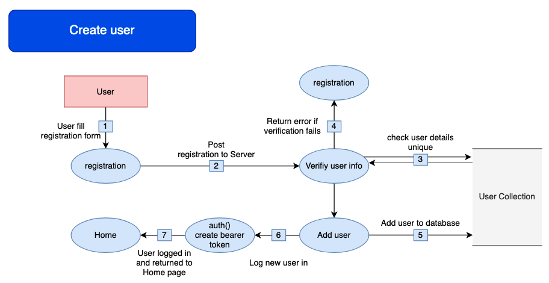
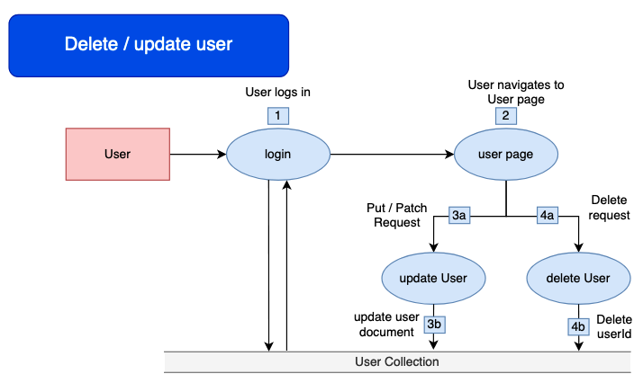
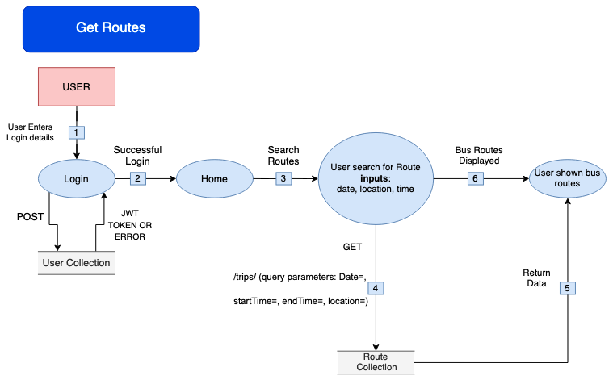
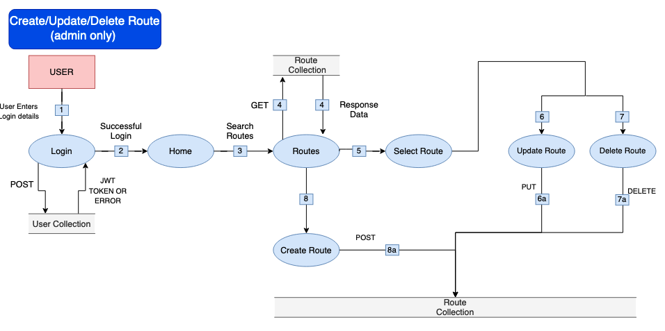
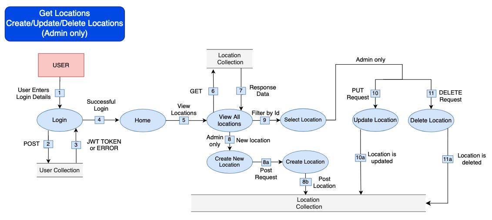
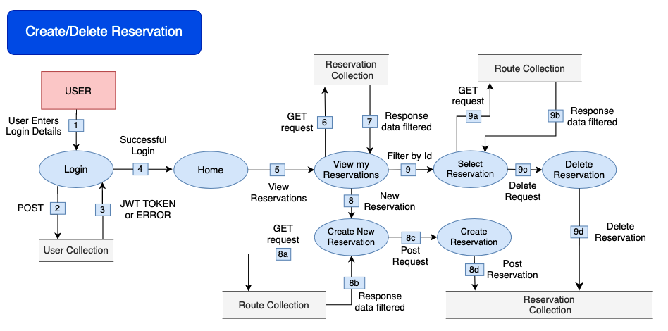
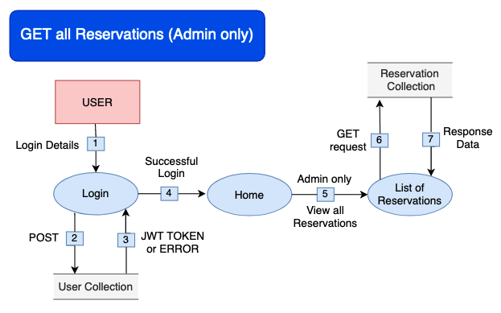

# T3A2A

# Development Team 
### Dirk Booy
[GitHub Profile](https://github.com/dtbooy)
### Derdriu McAteer
[GitHub Profile](https://github.com/derdriu-mcateer)
### Max Handley
[GitHub Profile](https://github.com/maxhandley97)

# R1 	Description of your website:
## Purpose
Our client, Client X is the proprietor of a shuttle bus company and has secured a grant to provide public shuttle service for the Brisbane 2032 Olympics. Client X has requested the development of a full stack web application which will streamline the process of securing a ticket for a shuttle service. This web application will allow users to view and book shuttle bus tickets to and from various venues across Brisbane, ensuring smooth and efficient transportation throughout the duration of the Olympics.

While traditional methods of booking shuttle bus tickets often involve long queues or phone calls, which can be time-consuming and inconvenient for users, our web application offers a more convenient and efficient way for users to book their tickets, saving them time and effort.
Users will be able to access the booking system from anywhere with an internet connection, whether it's from their home, office, or on the go. This accessibility makes it easier for users to plan their transportation needs and book tickets at their convenience. Our web application can provide real-time updates on shuttle bus schedules, availability of seats, and any changes or delays. This ensures that users have accurate information at their fingertips and can make informed decisions when booking their tickets.

Client X has specified that they will be providing services to three main event venues: Brisbane Cricket Ground, Brisbane Arena and Brisbane Football Stadium. They have also specified three locations in Brisbane they will be providing the pick up and drop off services: Eagle Farm, Queen Street Mall Bus Station, Toowong. Client X desires a scalable application architecture that seamlessly accommodates the addition of new locations. This flexibility ensures that the application can efficiently scale to meet evolving business needs, allowing for the effortless integration of additional locations as required.

## Functionality / features

## Target audience
The application is targeted towards members of the general public who will be attending events at the Brisbane 2032 olympics. The web application is strategically designed to cater to a diverse audience with varying needs and preferences. It is accessible and user friendly for individuals of all backgrounds and abilities. Whether the user is a Brisbane resident, an international visitor, an athlete or an official/volunteer, the web application ensures an intuitive navigation to ensure seamless access to the free shuttle bus service. 

## Tech stack 	GENERAL

# R2 	Dataflow Diagrams

1. User fills out login form, WebClient sends Post request to API with entered username & password
2. Login route:
 * Receives Post with request username and request password
 * Gets user document where username = request username from database
 * Compare password hashes, if match pass user document to auth()
3. Create bearer token including:
 * exp: 1 hour
 * sub: user_id
 * isAdmin: isAdmin
4. If password hashes do not match an Error is returned
5. If password hashes match bearer token is return

1. User fills in registration form
2. Post request to API with registration information
3. Verify input info - check database for existing email / username
4. If verification fails - return an error message and display on registration page
5. On passing verification add user to database
6. Log in new user - Call auth() function (creates bearer token)
7. Return user to home page (logged in)

1. User logs in
2. User navigates to user information page
3. User updates details:
   - Patch request sent to API  
   - Updated information is verified and user document is updated in database
4. User requests deletion of account:
   - Delete request sent to API  
   - User document is deleted from database

1. User Logins
2. Upon successful login the user is taken to the home screen
3.  User searches for a bus route by providing three inputs: date, location and time  
4. Upon searching a get request is sent to the db to receive the appropriate routes in the route collection 
5. The selected routes are return to be displayed
6. The user is displayed the appropriate bus routes based on their search parameters 

1. Admin Logs in
2. Upon successful login, admin is taken to the home screen
3. Admin searches for available routes
4. List of available routes are returned and displayed to the user based on their search criteria
5. Admin selects a route from the available routes and can proceed to update or delete route 
6. Admin can select to update route details
   - Sends a PUT request to the route collection 
7. Admin can select to delete a route 
   - Sends a DELETE request to the route collection 
8. Admin can select to create a new route 
   - Sends a POST request to the route collection

1. User signs in  
2. Post request to User collection  
3. JWT or Error response
4. User sent to homepage
5. User is sent to a list of Locations
6. Get request sent to Locations collection
7. Server sends response data
8. If admin, new location available
   - Admin is able to create new location with Post request
   - New location is posted
9. User can select a singular location for more information
10. If admin user, update location is available
   - If admin edits a route, a PUT request is sent to API
   - Updated information is verified and Location document is updated in the database
11. If admin user, delete location is available
   - If admin selects delete location, a delete request sent to API
   - Location document is deleted from the database

1. User signs in  
2. Post request to User collection  
3. JWT or Error response
4. User sent to homepage
5. When User clicks “My Reservations” 
6. A get request is sent to the Reservations collections and
7. Reservations are filtered by User_Id and presented.
8. User selects create new reservation
   - A get request is sent to the route collection
   - responds with data on available routes
   - Once selected, a post request is sent to API
   - User Reservation is created
9. User selects to view singular reservation
   - get request is sent to the route collection
   - responds with more data on the selected route
   - When delete reservation is selected a delete request is sent to the API
   - Reservations document is deleted from the database

1. User signs in  
2. Post request to User collection  
3. JWT or Error response
4. User sent to homepage
5. If Admin, option to view all reservations
6. A get request is sent to Reservation Collection 
7. Response data lists all the reservations

# R3 	Application Architecture Diagram

# R4 	User Stories

# R5 	Wireframes for multiple standard screen sizes, created using industry standard software

# R6 	Screenshots of your Trello board throughout the duration of the project

